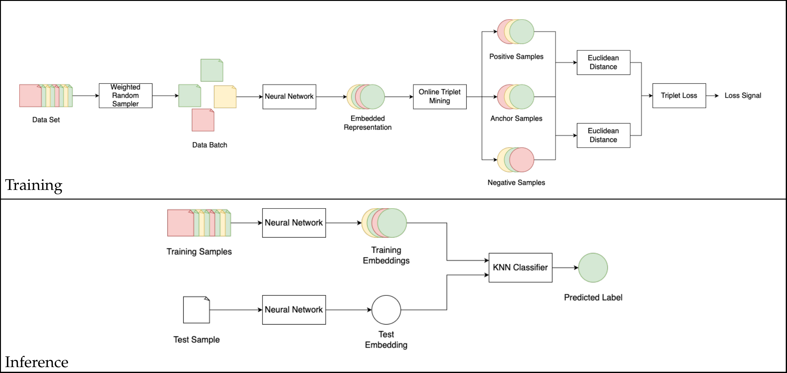

# Few-Shot Network Intrusion Detection using Online Triplet Mining
<p align="center">
  
</p>

Official Github repo for the paper "Few-Shot Network Intrusion Detection using Online Triplet Mining". This repository covers a reference implementation for online triplet mining with KNN-based inference and the model selection procedure is described in [this work](https://doi.org/10.3390/app16104589).

## Online Triplet Mining

The triplet network uses a multilayer perceptron architecture ($\phi: \mathbb{R}^f \!\to \mathbb{R}^{f_o}$) which takes a set of tabular features ($\mathbb{R}^{f}$) and maps them to an embedded representation ($\mathbb{R}^{f_o}$) in which samples of the same class are close together, while samples of two different distributions are far apart. A triplet network can be instantiated using the [`ContrastiveMLP`](triplet_network/model.py#L127) class as shown below:

```python
from triplet_network.model import ContrastiveMLP
import torch

# instantiate the ContrastiveMLP model
# d_in: input dimension (number of features)
# neurons: list of hidden layer dimensions
# d_out: output dimension for projection head
model = ContrastiveMLP(
    d_in = 32,  # input feature dimension
    neurons = [64, 64],  # hidden layer sizes
    d_out = 16,  # projection head output dimension
)

# raw input features: [bsz, d_in]
features = torch.randn(1024, 32)  # batch_size=1024, d_in=32

# forward pass through MLP feature extractor
extracted_features = model.forward_features(features)  # [1024, 32]

# forward pass through projection head
projected_features = model.forward_probe(extracted_features)  # [1024, 16]
```

The online triplet mining loss function is used to train the triplet network. It is an adaptation of the standard triplet loss function where the loss is calculated over all valid triplets in a batch of embeddings. Various mining strategies are available in [`triplet_network/loss.py`](triplet_network/loss.py), including [`BatchAllTripletLoss`](triplet_network/loss.py#L217), [`BatchSemiHardTripletLoss`](triplet_network/loss.py#L338), and [`BatchHardTripletLoss`](triplet_network/loss.py#L383). Usage is shown below:

```python
from triplet_network.loss import BatchAllTripletLoss
import torch

# instantiate the triplet loss with margin m
margin = 1.0
criterion = BatchAllTripletLoss(m=margin)

# embeddings: [bsz, embedding_dim]
# embeddings should be L2 normalized
embeddings = torch.randn(1024, 16)  # batch_size=32, embedding_dim=16
embeddings = torch.nn.functional.normalize(embeddings, p=2, dim=-1)

# target labels: [bsz]
labels = torch.tensor([0, 0, 1, 1, 2, 2, ...], dtype = torch.int64)  # class labels for each sample

# calculate triplet loss
loss = criterion(embeddings=embeddings, target=labels)

# get fraction of positive triplets used in the loss
frac_positive = criterion.get_fraction_pos()
```

## Inference

Inference is performed by first embedding the training and test data using [`extract_features`](utils/process_batch.py#L35), then applying a [`knn_classifier`](triplet_network/knn_classifier.py#L162) and evaluating with [`model_eval`](utils/model_eval.py#L83) as shown below:

```python
from utils.process_batch import extract_features
from triplet_network.knn_classifier import knn_classifier
from utils.model_eval import model_eval
import torch

# load model and move to device
model = ...  # your trained ContrastiveMLP model
device = torch.device('cuda' if torch.cuda.is_available() else 'cpu')
model = model.to(device)

# extract embeddings from training data
train_embeddings, train_labels = extract_features(
    model=model,
    x_data=x_train,
    y_data=y_train,
    batch=True,
    chunk_size=1024
)

# extract embeddings from test data
test_embeddings, test_labels = extract_features(
    model=model,
    x_data=x_test,
    y_data=y_test,
    batch=True,
    chunk_size=1024
)

# move to device for GPU-accelerated KNN
train_embeddings = train_embeddings.to(device)
test_embeddings = test_embeddings.to(device)
train_labels = train_labels.to(device)
test_labels = test_labels.to(device)

# perform KNN classification
y_true, y_pred = knn_classifier(
    x_train=train_embeddings,
    y_train=train_labels,
    x_test=test_embeddings,
    y_test=test_labels,
    k=5,
    dist_fn='euclidean',
    weight_fn='hard',
    num_chunks=100,
    num_classes=None,
    temp=None
)

# evaluate performance metrics
metrics = model_eval(
    y_true=y_true,
    y_pred=y_pred,
    label='test',
    return_class_level=True,
    return_detection_metrics=True
)

print(metrics)
```

## Comparison

### Binary classification

The triplet network outperforms baseline models when trained on at least 20 samples per malicious class in binary classification. A comparison of the proposed triplet network with several baseline models on the CICIDS2017 and Lycos2017 datasets in binary classification is given in the table below, where bold values indicate the best performance for each metric, with lower values preferred for false-positive rate:

<table style="border-collapse: collapse; border-spacing: 0;">
  <thead>
    <tr style="border-bottom: none;">
      <th rowspan="2">Samples</th>
      <th rowspan="2">Model</th>
      <th style="border: none;" colspan="4">CICIDS2017</th>
      <th style="border: none;" colspan="4">Lycos2017</th>
    </tr>
    <tr style="border-top: none;">
      <th>F1-Score</th>
      <th>Recall</th>
      <th>Precision</th>
      <th>FP Rate</th>
      <th>F1-Score</th>
      <th>Recall</th>
      <th>Precision</th>
      <th>FP Rate</th>
    </tr>
  </thead>
  <tbody>
    <tr><td>10</td><td><strong>Triplet</strong></td><td><strong>0.9508</strong></td><td><strong>0.9180</strong></td><td><strong>0.9910</strong></td><td><strong>0.0001</strong></td><td>0.9870</td><td>0.9822</td><td><strong>0.9921</strong></td><td><strong>0.0015</strong></td></tr>
    <tr><td>10</td><td>RENOIR</td><td>0.8620</td><td>0.8782</td><td>0.8547</td><td>0.031708</td><td><strong>0.9876</strong></td><td><strong>0.9879</strong></td><td>0.9872</td><td>0.006618</td></tr>
    <tr><td>10</td><td>AE</td><td>0.8351</td><td>0.7886</td><td>0.9326</td><td>0.007858</td><td>0.7513</td><td>0.7217</td><td>0.8690</td><td>0.019926</td></tr>
    <tr><td>10</td><td>DAE-LR</td><td>0.8280</td><td>0.7662</td><td>0.9540</td><td>0.002579</td><td>0.7427</td><td>0.7073</td><td>0.8787</td><td>0.011905</td></tr>
    <tr><td>10</td><td>SVM</td><td>0.3179</td><td>0.2698</td><td>0.4203</td><td>0.504890</td><td>0.2734</td><td>0.2510</td><td>0.3003</td><td>0.499617</td></tr>
    <tr><td colspan="10" style="padding:0;margin:0;border:none;height:1px;"><div style="height:1px;background:#e6e6e6;margin:0;padding:0;"></div></td></tr>
    <tr><td>20</td><td><strong>Triplet</strong></td><td><strong>0.9562</strong></td><td><strong>0.9276</strong></td><td><strong>0.9902</strong></td><td><strong>0.0004</strong></td><td><strong>0.9899</strong></td><td>0.9875</td><td><strong>0.9924</strong></td><td><strong>0.0026</strong></td></tr>
    <tr><td>20</td><td>RENOIR</td><td>0.8512</td><td>0.8643</td><td>0.8615</td><td>0.026064</td><td>0.9879</td><td><strong>0.9898</strong></td><td>0.9861</td><td>0.008017</td></tr>
    <tr><td>20</td><td>AE</td><td>0.7926</td><td>0.7457</td><td>0.9201</td><td>0.006597</td><td>0.7636</td><td>0.7316</td><td>0.8632</td><td>0.024317</td></tr>
    <tr><td>20</td><td>DAE-LR</td><td>0.8504</td><td>0.7891</td><td>0.9600</td><td>0.002455</td><td>0.7792</td><td>0.7430</td><td>0.8895</td><td>0.013361</td></tr>
    <tr><td>20</td><td>SVM</td><td>0.3177</td><td>0.2695</td><td>0.4202</td><td>0.505430</td><td>0.2733</td><td>0.2509</td><td>0.3003</td><td>0.499817</td></tr>
    <tr><td colspan="10" style="padding:0;margin:0;border:none;height:1px;"><div style="height:1px;background:#e6e6e6;margin:0;padding:0;"></div></td></tr>
    <tr><td>40</td><td><strong>Triplet</strong></td><td><strong>0.8613</strong></td><td>0.8433</td><td><strong>0.8841</strong></td><td><strong>0.0001</strong></td><td><strong>0.9916</strong></td><td>0.9913</td><td><strong>0.9920</strong></td><td><strong>0.0039</strong></td></tr>
    <tr><td>40</td><td>RENOIR</td><td>0.7950</td><td><strong>0.9141</strong></td><td>0.7647</td><td>0.119111</td><td>0.9903</td><td><strong>0.9931</strong></td><td>0.9875</td><td>0.007845</td></tr>
    <tr><td>40</td><td>AE</td><td>0.8460</td><td>0.7993</td><td>0.9246</td><td>0.008601</td><td>0.7940</td><td>0.7750</td><td>0.8542</td><td>0.043376</td></tr>
    <tr><td>40</td><td>DAE-LR</td><td>0.8696</td><td>0.8178</td><td>0.9542</td><td>0.004178</td><td>0.8194</td><td>0.7833</td><td>0.8951</td><td>0.018561</td></tr>
    <tr><td>40</td><td>SVM</td><td>0.3179</td><td>0.2698</td><td>0.4203</td><td>0.504874</td><td>0.2733</td><td>0.2508</td><td>0.3002</td><td>0.499884</td></tr>
    <tr><td colspan="10" style="padding:0;margin:0;border:none;height:1px;"><div style="height:1px;background:#e6e6e6;margin:0;padding:0;"></div></td></tr>
    <tr><td>80</td><td><strong>Triplet</strong></td><td><strong>0.9609</strong></td><td>0.9343</td><td><strong>0.9920</strong></td><td><strong>0.0002</strong></td><td><strong>0.9910</strong></td><td>0.9927</td><td><strong>0.9895</strong></td><td><strong>0.0062</strong></td></tr>
    <tr><td>80</td><td>RENOIR</td><td>0.8632</td><td><strong>0.9381</strong></td><td>0.8322</td><td>0.064756</td><td>0.9905</td><td><strong>0.9940</strong></td><td>0.9872</td><td>0.008326</td></tr>
    <tr><td>80</td><td>AE</td><td>0.8180</td><td>0.7817</td><td>0.8797</td><td>0.015057</td><td>0.8843</td><td>0.9043</td><td>0.8733</td><td>0.084521</td></tr>
    <tr><td>80</td><td>DAE-LR</td><td>0.8785</td><td>0.8460</td><td>0.9243</td><td>0.010217</td><td>0.8441</td><td>0.8237</td><td>0.8918</td><td>0.035378</td></tr>
    <tr><td>80</td><td>SVM</td><td>0.3185</td><td>0.2704</td><td>0.4205</td><td>0.503456</td><td>0.2734</td><td>0.2510</td><td>0.3003</td><td>0.499488</td></tr>
    <tr><td colspan="10" style="padding:0;margin:0;border:none;height:1px;"><div style="height:1px;background:#e6e6e6;margin:0;padding:0;"></div></td></tr>
    <tr><td>160</td><td><strong>Triplet</strong></td><td><strong>0.9605</strong></td><td>0.9398</td><td><strong>0.9841</strong></td><td><strong>0.0019</strong></td><td><strong>0.9926</strong></td><td><strong>0.9947</strong></td><td><strong>0.9906</strong></td><td><strong>0.0058</strong></td></tr>
    <tr><td>160</td><td>RENOIR</td><td>0.8275</td><td><strong>0.9416</strong></td><td>0.7789</td><td>0.089986</td><td>0.9904</td><td>0.9942</td><td>0.9867</td><td>0.008761</td></tr>
    <tr><td>160</td><td>AE</td><td>0.8489</td><td>0.8700</td><td>0.8316</td><td>0.037868</td><td>0.8554</td><td>0.8899</td><td>0.8392</td><td>0.124640</td></tr>
    <tr><td>160</td><td>DAE-LR</td><td>0.8959</td><td>0.8806</td><td>0.9131</td><td>0.014502</td><td>0.8411</td><td>0.8526</td><td>0.8366</td><td>0.092028</td></tr>
    <tr><td>160</td><td>SVM</td><td>0.3184</td><td>0.2700</td><td>0.4203</td><td>0.503287</td><td>0.2737</td><td>0.2514</td><td>0.3005</td><td>0.498752</td></tr>
  </tbody>
</table>

### Multiclass classification

The triplet network outperforms other gradient based methods when trained on at least 40 samples per malicious class in multiclass classification. A comparison of the proposed triplet network with several baseline models on the CICIDS2017 and Lycos2017 datasets in multiclass classification is given in the table below, where bold values indicate the best performance for each metric, with lower values preferred for false-positive rate:

<table style="border-collapse: collapse; border-spacing: 0;">
  <thead>
    <tr style="border-bottom: none;">
      <th rowspan="2">Samples</th>
      <th rowspan="2">Model</th>
      <th style="border: none;" colspan="4">CICIDS2017</th>
      <th style="border: none;" colspan="4">Lycos2017</th>
    </tr>
    <tr style="border-top: none;">
      <th>F1-Score</th>
      <th>Recall</th>
      <th>Precision</th>
      <th>FP Rate</th>
      <th>F1-Score</th>
      <th>Recall</th>
      <th>Precision</th>
      <th>FP Rate</th>
    </tr>
  </thead>
  <tbody>
    <tr><td>10</td><td><strong>Triplet</strong></td><td>0.8757</td><td>0.7967</td><td><strong>0.9916</strong></td><td><strong>0.000272</strong></td><td><strong>0.7802</strong></td><td>0.7576</td><td><strong>0.8240</strong></td><td><strong>0.001476</strong></td></tr>
    <tr><td>10</td><td>Siamese</td><td>0.6312</td><td>0.8060</td><td>0.6283</td><td>0.208661</td><td>0.6416</td><td>0.7707</td><td>0.6155</td><td>0.155338</td></tr>
    <tr><td>10</td><td>MLP</td><td>0.7892</td><td><strong>0.8211</strong></td><td>0.7870</td><td>0.023389</td><td>0.7615</td><td><strong>0.8516</strong></td><td>0.7535</td><td>0.012975</td></tr>
    <tr><td>10</td><td>KNN</td><td><strong>0.8825</strong></td><td>0.8070</td><td><strong>0.9928</strong></td><td><strong>0.000264</strong></td><td>0.7582</td><td>0.7440</td><td>0.7876</td><td>0.001542</td></tr>
    <tr><td colspan="10" style="padding:0;margin:0;border:none;height:1px;"><div style="height:1px;background:#e6e6e6;margin:0;padding:0;"></div></td></tr>
    <tr><td>20</td><td><strong>Triplet</strong></td><td>0.8514</td><td>0.7817</td><td>0.9511</td><td><strong>0.000204</strong></td><td><strong>0.8119</strong></td><td>0.8178</td><td><strong>0.8127</strong></td><td>0.002353</td></tr>
    <tr><td>20</td><td>Siamese</td><td>0.6735</td><td>0.8127</td><td>0.6512</td><td>0.154800</td><td>0.6631</td><td>0.8201</td><td>0.6289</td><td>0.153519</td></tr>
    <tr><td>20</td><td>MLP</td><td>0.7892</td><td><strong>0.8211</strong></td><td>0.7870</td><td>0.023389</td><td>0.7776</td><td><strong>0.8869</strong></td><td>0.7587</td><td>0.013883</td></tr>
    <tr><td>20</td><td>KNN</td><td><strong>0.8873</strong></td><td>0.8148</td><td><strong>0.9905</strong></td><td>0.000246</td><td>0.8024</td><td>0.8133</td><td>0.8012</td><td><strong>0.002075</strong></td></tr>
    <tr><td colspan="10" style="padding:0;margin:0;border:none;height:1px;"><div style="height:1px;background:#e6e6e6;margin:0;padding:0;"></div></td></tr>
    <tr><td>40</td><td><strong>Triplet</strong></td><td><strong>0.8957</strong></td><td>0.8260</td><td><strong>0.9917</strong></td><td><strong>0.000151</strong></td><td><strong>0.8346</strong></td><td>0.8755</td><td><strong>0.8116</strong></td><td>0.003305</td></tr>
    <tr><td>40</td><td>Siamese</td><td>0.6431</td><td>0.8011</td><td>0.6597</td><td>0.254220</td><td>0.6628</td><td>0.8584</td><td>0.6227</td><td>0.086839</td></tr>
    <tr><td>40</td><td>MLP</td><td>0.7892</td><td>0.8211</td><td>0.7870</td><td>0.023389</td><td>0.7887</td><td><strong>0.9054</strong></td><td>0.7657</td><td>0.014829</td></tr>
    <tr><td>40</td><td>KNN</td><td>0.8947</td><td><strong>0.8268</strong></td><td>0.9875</td><td>0.000375</td><td>0.8218</td><td>0.8581</td><td>0.8007</td><td><strong>0.002714</strong></td></tr>
    <tr><td colspan="10" style="padding:0;margin:0;border:none;height:1px;"><div style="height:1px;background:#e6e6e6;margin:0;padding:0;"></div></td></tr>
    <tr><td>80</td><td><strong>Triplet</strong></td><td><strong>0.9008</strong></td><td><strong>0.8365</strong></td><td><strong>0.9875</strong></td><td><strong>0.000312</strong></td><td><strong>0.8343</strong></td><td>0.9156</td><td><strong>0.8029</strong></td><td>0.005954</td></tr>
    <tr><td>80</td><td>Siamese</td><td>0.7023</td><td>0.8323</td><td>0.6695</td><td>0.118468</td><td>0.6775</td><td>0.8677</td><td>0.6307</td><td>0.074649</td></tr>
    <tr><td>80</td><td>MLP</td><td>0.7892</td><td>0.8211</td><td>0.7870</td><td>0.023389</td><td>0.7870</td><td><strong>0.9212</strong></td><td>0.7448</td><td>0.014582</td></tr>
    <tr><td>80</td><td>KNN</td><td>0.8983</td><td>0.8334</td><td>0.9857</td><td>0.000412</td><td>0.8268</td><td>0.8777</td><td>0.7980</td><td><strong>0.003405</strong></td></tr>
    <tr><td colspan="10" style="padding:0;margin:0;border:none;height:1px;"><div style="height:1px;background:#e6e6e6;margin:0;padding:0;"></div></td></tr>
    <tr><td>160</td><td><strong>Triplet</strong></td><td><strong>0.9035</strong></td><td>0.8469</td><td>0.9776</td><td>0.000615</td><td><strong>0.8446</strong></td><td>0.9236</td><td><strong>0.8109</strong></td><td>0.005641</td></tr>
    <tr><td>160</td><td>Siamese</td><td>0.7519</td><td><strong>0.8495</strong></td><td>0.7246</td><td>0.048695</td><td>0.6867</td><td>0.8895</td><td>0.6401</td><td>0.079567</td></tr>
    <tr><td>160</td><td>MLP</td><td>0.7892</td><td>0.8211</td><td>0.7870</td><td>0.023389</td><td>0.7920</td><td><strong>0.9296</strong></td><td>0.7462</td><td>0.013501</td></tr>
    <tr><td>160</td><td>KNN</td><td>0.9022</td><td>0.8431</td><td><strong>0.9803</strong></td><td><strong>0.000579</strong></td><td>0.8169</td><td>0.8944</td><td>0.7773</td><td><strong>0.005129</strong></td></tr>
  </tbody>
</table>

## Running

### (1) Install Requirements

This repository requires python3 and Pytorch. To install the required dependencies run:

```
pip install -r requirements.txt
```

### (2) Download Datasets

Models and baselines are trained and evaluated on the following datasets:

- [CICIDS2017](https://huggingface.co/datasets/jackwilkie/cicids_2017)
- [Lycos2017](https://lycos-ids.univ-lemans.fr/)

After downloading the datasets, place them in the `datasets/` directory:

```text
./datasets/cicids2017.csv
./datasets/lycos2017.csv
```

### (3) Train Model

A single training run can be performed using the [`train_model.py`](./train_model.py) script:

```
python3 train_model.py
```

The script will train the model and save the weights to `./results/triplet_network/triplet_network.pt.tar`.

### (4) Evaluate Model

After training a single evaluation run of the triplet network can be performed using the [`evaluate_model.py`](./evaluate_model.py) script:

```
python3 evaluate_model.py
```

The performance metrics of each model will be printed to the terminal after evaluation and also saved to `./results/triplet_network/performance.json`.

### (5) Optimise Hyperparameters

Hyperparameter optimising of the triplet network across all dataset sizes can be performed using the [`fit_model.py`](./fit_model.py) script:

```
python3 fit_model.py
```

The performance metrics of each model will be printed to the terminal after evaluation and also saved to `./results/hyperparameter_optimisation/hp_search.csv`.

### (6) Evaluate Best Configuration

Hyperparameter optimising of the triplet network across all dataset sizes can be performed using the [`eval_best.py`](./eval_best.py) script:

```
python3 eval_best.py
```

The performance metrics of each model will be printed to the terminal after evaluation and also saved to `./results/hyperparameter_optimisation/hp_search.csv`.

## Citation
```
@Article{app16104589,
AUTHOR = {Wilkie, Jack and Hindy, Hanan and Tachtatzis, Christos and Bures, Miroslav and Atkinson, Robert},
TITLE = {Few-Shot Network Intrusion Detection Using Online Triplet Mining},
JOURNAL = {Applied Sciences},
VOLUME = {16},
YEAR = {2026},
NUMBER = {10},
ARTICLE-NUMBER = {4589},
URL = {https://www.mdpi.com/2076-3417/16/10/4589},
ISSN = {2076-3417},
}
```